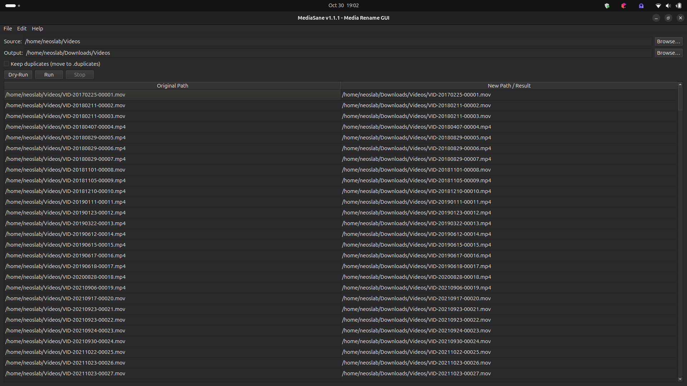

# MediaSane — Media Rename GUI


**MediaSane** is a fast, no-nonsense GUI utility to **organize and rename photos/videos**. It derives dates from **EXIF/metadata** (falls back to mtime/today), applies clean prefixes (e.g. `IMG-` / `VID-`), detects **duplicates by content hash**, and moves files safely with a **dry-run preview**, **stop** control, and robust temp-file finalization.

* * *

## Features

- GUI-based media organizer — no terminal needed
- Smart date resolution: **filename date → EXIF → mtime → today**
- Image/Video detection with configurable **prefixes** (`IMG-`, `VID-`)
- **Duplicate handling** (SHA-256 with time budget, optional keep)
- **Dry-Run** preview (no changes), **Run**, and **Stop** button
- Streaming table of operations (source → destination/result)
- Optional **output directory** (or rename in place)
- Safe moves via temp names; collision-aware finalization
- Lightweight config at `~/.config/mediasane/config`

* * *

## Screenshots

> (Place your screenshots into a `screenshots/` folder and update the paths below.)




* * *

## Requirements

- Linux (Ubuntu/Debian recommended). Should also run on macOS/Windows with PyQt6 installed.
- Python **3.9+**
- Packages:

```bash
sudo apt update
sudo apt install -y python3-pyqt6 exiftool
````

> `exiftool` is **optional** but strongly recommended for accurate date extraction.
> Without it, MediaSane falls back to filename date and file modification time.

* * *

## Installation

Clone and run from source:

```bash
git clone https://github.com/neoslabx/mediasane
cd mediasane
python -m pip install --upgrade pip
python -m pip install -r requirements.txt
python mediasane.py
```

(If your entry file is different, e.g. `main.py`, adjust the last line accordingly.)

* * *

## Usage

1. **Source**: pick the folder that contains your photos/videos.
2. **Output** (optional): pick a different folder to place renamed files; leave empty to rename in place.
3. **Keep duplicates**:

   * **Checked**: duplicates are moved into a `.duplicates` subfolder (without deleting anything).
   * **Unchecked**: duplicates are **deleted** (conservatively, with content-hash detection).
   
4. Choose **Dry-Run** to preview the plan or **Run** to execute.
   Use **Stop** to cancel safely.

### What you’ll see in the table

* **Original Path** → **New Path / Result**
* A final destination path when a rename is planned/done.
* `(deleted)` for duplicates removed when *Keep duplicates* is unchecked.
* `(unsupported)` for files with extensions outside the allowed sets.

> Allowed extensions:
> **Images:** `jpg jpeg png gif tif tiff bmp webp heic heif`
> **Videos:** `mp4 mov m4v avi mkv 3gp webm`

* * *

## Preferences

Open **Edit → Preferences** to configure:

* **Image prefix** (default `IMG-`)
* **Video prefix** (default `VID-`)

These prefixes are used to build filenames like:

```
IMG-YYYYMMDD-00001.jpg
VID-YYYYMMDD-00042.mp4
```

Settings are saved to `~/.config/mediasane/config` along with the last used source/output paths.

* * *

## How MediaSane Resolves Dates

For each file, MediaSane chooses the best available date:

1. **Leading date in the current filename** (e.g. `20240421_*`)
2. **EXIF/metadata** via `exiftool` (`DateTimeOriginal`, `CreateDate`, `MediaCreateDate`, `FileModifyDate`)
3. **File modification time**
4. **Today’s date** (last resort)

Dates are rendered as `YYYYMMDD`.

* * *

## Duplicate Detection

* MediaSane computes a content hash with a **time budget** (default 60s per file).
  If the budget is exceeded or I/O fails, it falls back to a **weak key** (`size@mtime`) to keep the UI responsive.
* Duplicates are either **deleted** or **moved to `.duplicates`** (based on the *Keep duplicates* checkbox).
* Duplicate moves ensure unique names (`name`, `name.1`, `name.2`, …).

* * *

## Safety

* **Dry-Run** mode lets you preview *every* planned operation.
* Renames use **temporary paths** with a random suffix (e.g. `.tmp-<uuid8>`) before finalization.
* If the final destination exists, MediaSane appends `_1`, `_2`, … to avoid clobbering.
* Cross-device moves fall back to **copy2 + unlink**.
* The internal `.duplicates` directory is **skipped** during scanning to avoid loops.

* * *

## Technical Design

Core components (in this repository):

* `SysUtils` — filesystem/EXIF/date helpers, hashing, safe moves
* `ExecPrefs` — user naming preferences (image/video prefixes)
* `ConfigManager` — load/save config in `~/.config/mediasane`
* `ExecOptions` — runtime options (paths, flags, timeouts)
* `MediaRenamer` — plan + execute: scan, de-dupe, rename, queue results
* `DialogPrefs` — preferences dialog (prefixes)
* `DialogAbout` — about box (logo, version, website)
* `MediaSane` — main window: menus, widgets, table, progress, timers
* `AppEntry` — Qt application bootstrap

* * *

## Development

Set up a Python environment and install dependencies:

```bash
python -m pip install --upgrade pip
python -m pip install -r requirements.txt
```

Run:

```bash
python mediasane.py
```

> Tip: For large folders, consider running **Dry-Run** first to assess the plan and hashing cost.

* * *

## Know bugs

### PyCharm warning

```
Cannot find reference 'connect' in 'pyqtSignal | function'
```

**Fix (stub tweak):** Edit `QtCore.pyi` in your environment’s `site-packages/PyQt6` and add `connect`/`emit` to `pyqtSignal`:

```python
# Support for new-style signals and slots.
class pyqtSignal:

    signatures = ...    # type: tuple[str, ...]

    def __init__(self, *types: typing.Any, name: str = ...) -> None: ...

    @typing.overload
    def __get__(self, instance: None, owner: type['QObject']) -> 'pyqtSignal': ...

    @typing.overload
    def __get__(self, instance: 'QObject', owner: type['QObject']) -> 'pyqtBoundSignal': ...

    # Cannot find reference 'connect' in 'pyqtSignal | function' fix
    def connect(self, slot: 'PYQT_SLOT') -> 'QMetaObject.Connection': ...
    def emit(self, *args: typing.Any) -> None: ...
```

> Note: Editing stubs is brittle. Alternatively, add `# type: ignore[attr-defined]` on lines where `connect`/`emit` are flagged.

### PyQt6 type-stubs error with `QDialogButtonBox`

**Error example:**

```
Unexpected type(s):(Literal[StandardButton.Cancel])
Possible type(s):(Literal[StandardButton.Ok])(Literal[StandardButton.Ok])
```

**Cause:** Some PyQt6 stubs model `setStandardButtons` as a single `StandardButton`, but at runtime it’s a flag enum, so `Ok | Cancel` gets flagged.

```python
from typing import cast
btns = QDialogButtonBox(parent=self)
buttons = cast(
    QDialogButtonBox.StandardButton,
    int(QDialogButtonBox.StandardButton.Ok) | int(QDialogButtonBox.StandardButton.Cancel)
)
btns.setStandardButtons(buttons)
```

* * *

## Known Issues & Notes

### `exiftool` availability

If `exiftool` is missing or times out, MediaSane gracefully falls back to mtime/today.

### Hash time budgets on very large files

When the SHA-256 computation exceeds the time budget, MediaSane uses a **weak key** (`size@mtime`) plus a quick `blake2b` prefix hash to keep things moving. You can re-run later for more precise de-duping if needed.

### PyCharm warning with PyQt signals

Some PyQt6 type stubs may flag `.connect()`/`.emit()` on signals. Consider adding `# type: ignore[attr-defined]` to affected lines or adjust stubs locally (not recommended for long-term).

### Network drives / cross-device renames

On cross-device moves (e.g., to another mount), MediaSane transparently falls back to `copy2` + delete. This can be slower than in-partition renames.

* * *

## Contributing

Contributions are welcome! Please:

1. Fork the repository.
2. Create a feature branch (`git checkout -b feature/your-feature`).
3. Commit your changes (`git commit -m "Add your feature"`).
4. Push the branch (`git push origin feature/your-feature`).
5. Open a pull request describing the change and rationale.

Please follow PEP 8 and include tests where appropriate.

* * *

## License

This project is licensed under the MIT License. See the [LICENSE](LICENSE) file for details.

* * *

## Contact

For issues, ideas, or questions, please open a **GitHub Issue** on the repository or contact the maintainer via the project’s issues page for follow-up.